  

  Founder · Software Engineer · Buenos Aires, Argentina

---

## Selected Work

### FounderOS
Context and decision infrastructure for founders.

`TypeScript` · `LLM orchestration` · `Retrieval` · `Evals` · `Context systems`

### Plexo
AI agents for real-world workflows.

`Voice AI` · `Tool Calling` · `State` · `Evals` · `Agent Systems`

### AI Privacy Guard
Local-first protection for sensitive data before it reaches an LLM.

→ [View repository](https://github.com/Zent-Agency/ai-privacy-guard)

`Privacy` · `Chrome Extensions` · `Local-first` · `LLMs`

---

## Interests

`Voice AI` · `Agents` · `Saving time` · `Evals` · `Context` · `Developer tools` · `Startups`

## Stack

`TypeScript` · `Python` · `Node.js` · `PostgreSQL` · `Docker`

`Tool Calling` · `RAG` · `Voice AI` · `LLM Evals` · `Agent Systems`
